# A3: User Interface Prototype
SegFault is a collaborative platform for programmers to learn, discuss different approaches, present ideas and share knowledge in a Q&A style.
To this end, the following sections provide detailed insight into the project, featuring storyboards for common uses of the site, and an overview of all interfaces.

## 1. Interface and common features

The user interface of the _SegFault_ platform is a set of web pages made using the latest standards: HTML5, Javascript, CSS3. For faster development Bootstrap was used.  
The platform is based on a responsive design, that is capable of being adapted to screens of different sizes and resolution without losing functionality.

The principal functionality of our platform are the questions of our users and the fast access to them. Because of that, our main page contain in their majority a preview of some questions of the users.  
A navigation bar has been implemented that allows for various interactions with the user, depending on whether the user is authenticated or not;

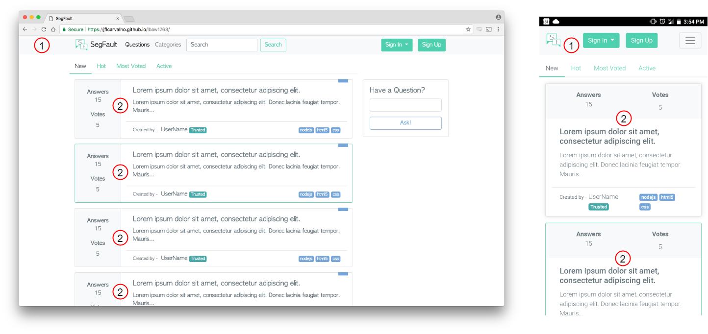
Figure 1.a: Main Interface.

1. NavBar;
2. Preview of Questions;

Besides that the answer to the question is very important, so in order to be easier to the user to see that, we develop for each question an individual page.

With more emphasis, in each question page the user can see the full description of the question and also some information about the author of the question and how many votes the question have.

Following the description it will appear all the answers to the question. If one answer was marked as correct it will appear first.

Each question our answer can be commented. All last tree can be voted in order to present first the better content and give reputation to the users. This privileges is just for the authenticated users.

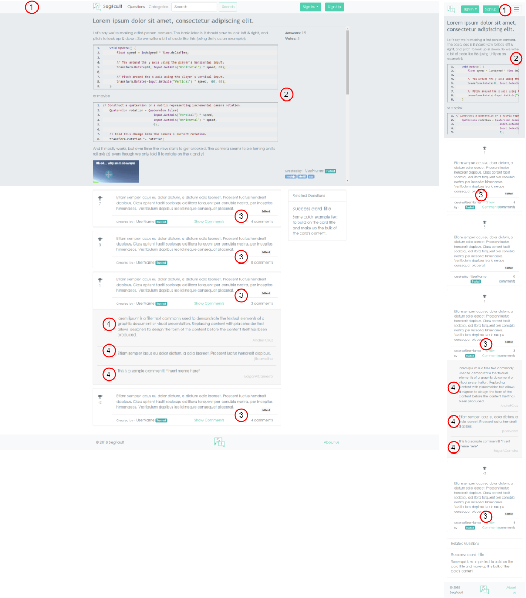
Figure 1.b: Question Interface.

1. NavBar;
2. Full description of the question;
3. Answers to the question;
4. Comments;
## 2. Sitemap

This sitemap presents the overall structure of the web application.

Figure 2.a: Sitemap.

## 3. Storyboards

This section displays step-by-step illustrations of the main use cases of the system.  

### Sign up

.png)

Figure 3.a: While visiting the website, to sign up you can click the "Sign up" button (1), which will redirect you to the "Sign up page" where you'll enter your personal credentials (2), accept our terms and conditions by checking the checkbox (3) and finally clicking "Sign up for SegFault" (4).

### Sign in

Figure 3.b: While visiting the website, to sign in you can click the "Sign in" button (1), then you'll be shown a dropdown where you'll have to fill your credentials (2) and finally enter them by clicking "Sign in" (3).

### Ask a question

.png)
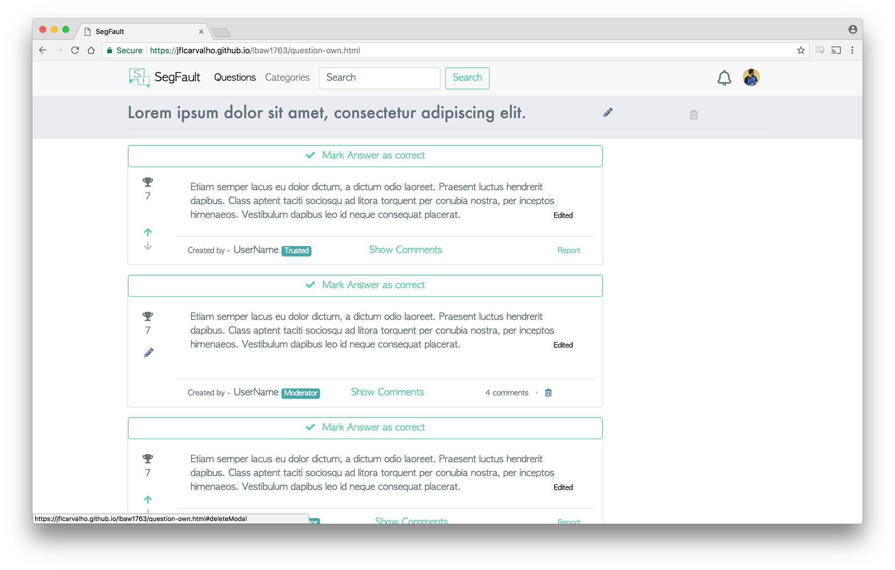
Figure 3.c: While logged in, to ask a question you must enter your question title (1) - which can later be modified -, click the "Ask!" button on (2) the landing page and you'll be redirected to the "ask question page". There you'll write your question on the text area (3), the related tags (4) and then submit it by clicking on the "Post your question" button (5).

### Answer a question

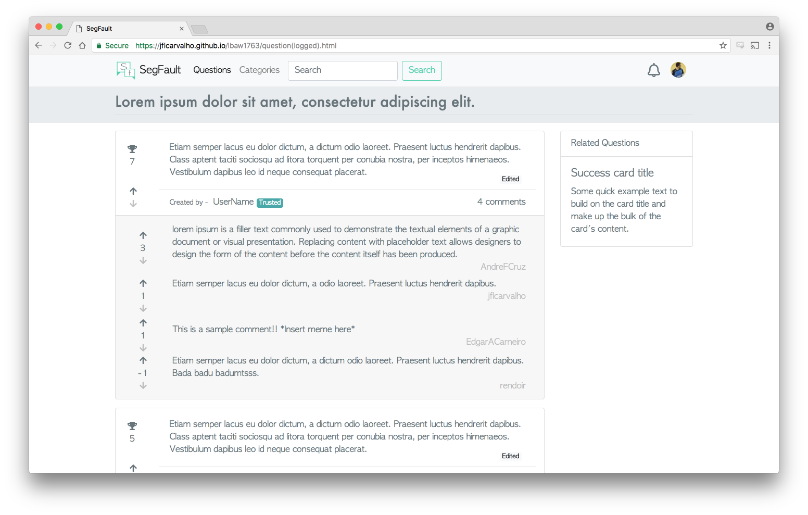
Figure 3.d: While logged in, to answer a question you must write your answer on the text area (1) and then submit your answer by clicking on the "Post answer" button (2).

### Add a comment

Figure 3.e: While logged in, to add a comment (to a question, for example) you should click the button that shows the comments to that message (1), then you'll be shown a text area where you can write your comment (2) and finally you can submit it by clicking on the "Add comment" button (3).

### Check profile

Figure 3.f: To check your profile click on your profile thumbnail (1), then you'll be shown a dropdown where you'll have to click on the  "Profile" option (2).

### Question page of an owner
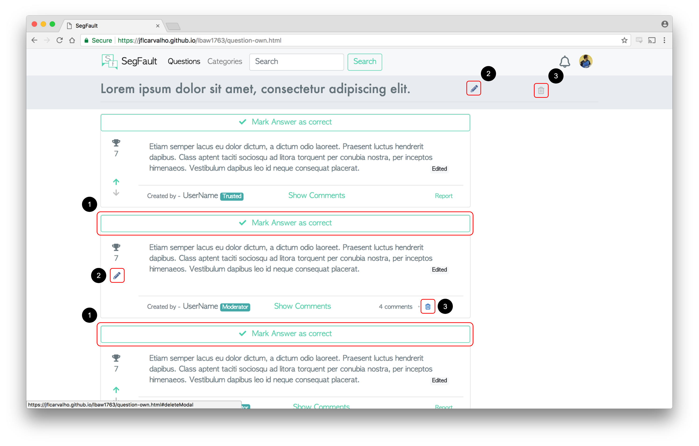
Figure 3.g: As an owner of a question you can mark an answer as correct (1), edit (2) or delete (3) any of your messages. Owner page [here](https://jflcarvalho.github.io/lbaw1763/question-own.html).

### Question page of a moderator
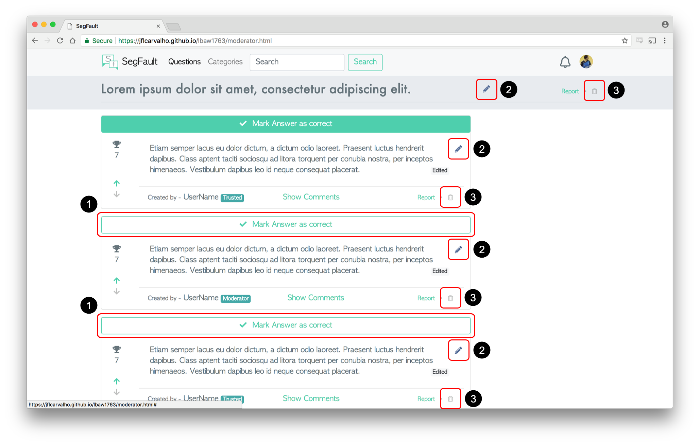
Figure 3.h: As a moderator you can mark an answer as correct for a given question (1), edit (2) or delete (3) any message. Moderator page [here](https://jflcarvalho.github.io/lbaw1763/moderator.html).

### Sign out

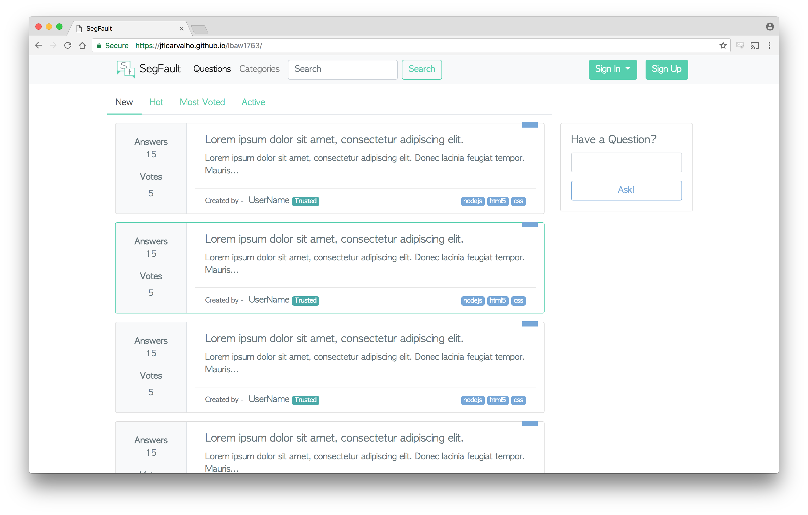
Figure 3.i: To log out you have to click on your profile thumbnail (1), then you'll be shown a dropdown where you'll have to click on the "Log out" option (2).

## 4. Interfaces

The following interfaces describe the main content of the web pages and their relative priority and help the project team previewing the features and behaviour of the final product's different screens, both their desktop (left) and mobile (right) versions.

### UI01: Home
On the [home page](https://jflcarvalho.github.io/lbaw1763/index.html), the user can view several questions to his choosing, their title, score, number of answers, and a short introduction. The user can also bookmark a question for ease of access. As customary, the user can search for a specific question using the _nav-bar_.

Additionally, an authenticated user can ask a new question: after introducing the title and clicking the "Ask!" button the user is redirected to the [question editing page](https://jflcarvalho.github.io/lbaw1763/ask_question.html). If a visitor (non-authenticated user) clicks the "Ask!" button, a "Sign-In" prompt appears.

Figure 4.a: [Home page](https://jflcarvalho.github.io/lbaw1763/index.html).

Figure 4.b: Home page, on mobile.

### UI02: About

The [about page](https://jflcarvalho.github.io/lbaw1763/about.html) informs the user of the the purpose of the site, as well as the team behind it. Additionally, the user can navigate to the developers' _SegFault_ profiles by clicking on them.

Figure 5.a: [About page](https://jflcarvalho.github.io/lbaw1763/about.html).

Figure 5.b: About page, on mobile.

### UI03: Question
The question page allows a user to see the full description of a question, as well as its answers and comments. An authenticated user can vote on a question, answer or comment, or report any of these.

Figure 6.a: [Question page](https://jflcarvalho.github.io/lbaw1763/question.html).

Figure 6.b: [Question page](https://jflcarvalho.github.io/lbaw1763/question.html), scrolled down.

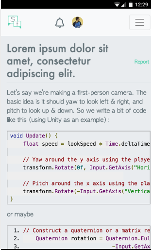
Figure 6.c: Question page, on mobile.

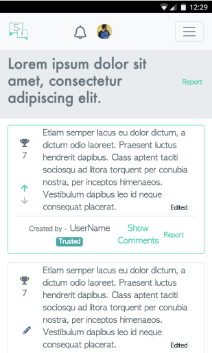
Figure 6.d: Question page, on mobile, scrolled down.

In addition, the owner of a question can accept an answer as correct, edit the question's description and categories, and/or delete it (owner view seen in Figure 6.e).

| Desktop | Mobile |
|:-------------:|:-------------:|
|  | 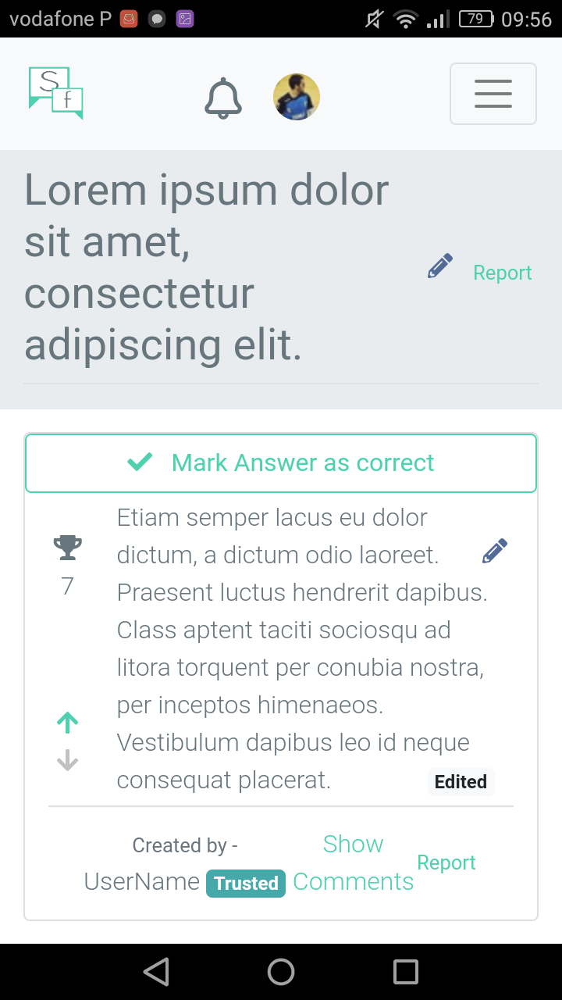 |

Figure 6.e: Question page, owner view.

### UI04: Ask a Question
This page allows an authenticated user to ask a question. The description can be designed with markdown, and features code syntax highlighting. The user can also add tags to a question.

Note that the title may already be filled in if the user was redirected from the main page's "Ask!" button.

Figure 7.a: [Ask question page](https://jflcarvalho.github.io/lbaw1763/ask_question.html).

Figure 7.b: Ask/Edit question page, on mobile.

### UI05: Profile

A user's [profile page](https://jflcarvalho.github.io/lbaw1763/own-profile.html) features its contributions to the _SegFault_ community, from comments, answers and questions posted, to its overall reputation and badges earned. The owner of a profile can change its profile picture and the short _bio_.

Figure 8.a: A user's [own profile page](https://jflcarvalho.github.io/lbaw1763/own-profile.html).

Figure 8.b: A user's [own profile page](https://jflcarvalho.github.io/lbaw1763/own-profile.html), scrolled down.

Figure 8.c: Profile page, on mobile.

Figure 8.d: Profile page, on mobile, scrolled down.

### UI06: Sign Up
The [sign up page](https://jflcarvalho.github.io/lbaw1763/sign-up.html) allows users to register on _SegFault_.

Figure 9.a: [Sign Up page](https://jflcarvalho.github.io/lbaw1763/sign-up.html).

Figure 9.b: Sign Up page, on mobile.

### UI08: Error
The [error page](https://jflcarvalho.github.io/lbaw1763/error.html) informs the user that the server has _segfaulted_, and thus cannot visit the page he was looking for.

Figure 10.a: [Error page](https://jflcarvalho.github.io/lbaw1763/error.html).

Figure 10.b: Error page, on mobile.

### UI09: Edit Profile
The [edit profile](https://jflcarvalho.github.io/lbaw1763/edit-profile.html) lets a user edit he's own profile (bio, picture and background).

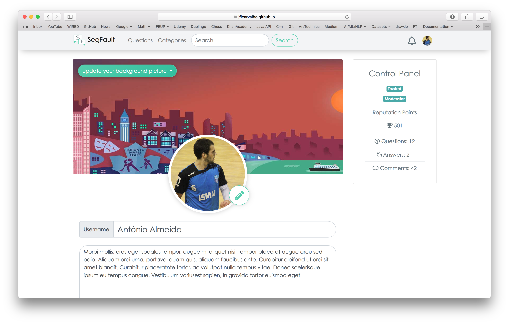
Figure 10.a: [Edit Profile](https://jflcarvalho.github.io/lbaw1763/edit-profile.html).

***

## Revision history
* 12/03/2018: Moved sign in/up/out from the User Area to (a new) Authentication Area in the Sitemap.
* 12/03/2018: Improved the order of the stories in the Story Board, added a title for each of them and added screenshots showing the results of the story.
* 13/03/2018: Updated screenshots.
* 11/04/2018: Added edit profile, UI09.

***

GROUP1763, 06/03/2018

> André Cruz, up201503776@fe.up.pt  
> Daniel Marques, up201503822@fe.up.pt  
> Edgar Carneiro, up201503784@fe.up.pt  
> João Carvalho, up201504875@fe.up.pt  
