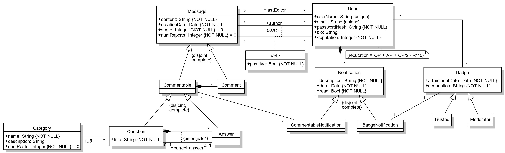

# A4: Conceptual Data Model
SegFault is a collaborative platform for programmers to learn, discuss different approaches, present ideas and share knowledge in a Q&A style.
To this end, the following sections provide detailed insight into the project's conceptual data model, featuring class diagrams and business rules.

## 1. Class diagram

## 2. Additional Business Rules
| Identifier | Name | Description |
|:----------:|:---------------:|:---------------------------------------------------------------------------:|
| BR01 | Correct Answer restriction | There can only be one answer marked as correct, per question. |
| BR02 | Self voting restriction | Users can't vote on their own messages. |
| BR03 | Reputation points | Reputation points will be calculated according to the formula: $QuestionPoints + AnswerPoints + \frac{CommentPoints}{2} - Reports * 10$. |
| BR04 | Number of categories | A question must have between one and five categories, _inclusive_. |
| BR05 | Moderator Badge | Having achieved 500 reputation points and been awarded the Trustworthy Badge, a Member becomes a Moderator. |
| BR06 | Delete Answer | Whenever an Answer is deleted the respective Comments should be deleted as well. |
| BR07 | Delete Question | Whenever a Question is deleted the respective Answers (their comments) and the Question comments should be deleted as well. |
| BR08 | Banned Message | A message is automatically eliminated after being reported over $(5 + score^{\frac{1}{3}})$ times. |
| BR09 | Edited Message | An edited message must be adequately marked as such. |

## Revision history

Changes made to the first submission:
1. Item 1
1. Item 2
 
***

GROUP1763, 08/03/2018

> André Cruz, up201503776@fe.up.pt  
> Daniel Marques, up201503822@fe.up.pt  
> Edgar Carneiro, up201503784@fe.up.pt  
> João Carvalho, up201504875@fe.up.pt  
